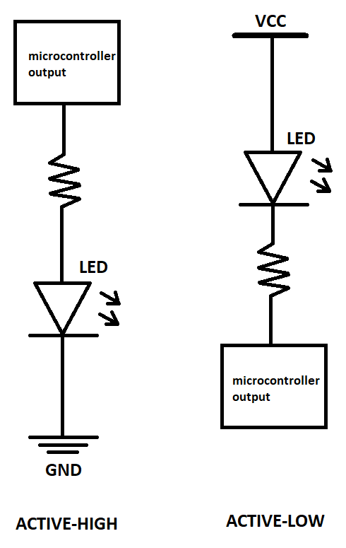

# Lab 2: Control of GPIO, LED, push button

#### Contents

1. [Lab prerequisites](#Lab-prerequisites)

# Lab prerequisites

* **Active-low** - microcontroller is connected to cathode
* **Active-high** - microcontroller is connected to annode

Resistor values:

| **LED color** | **Supply voltage** | **LED current** | **LED voltage** | **Resistor value** |
| :-: | :-: | :-: | :-: | :-: |
| red | 5&nbsp;V | 20&nbsp;mA | 1.8&nbsp&;V | 160&nbsp&;&Omega; |
| blue | 5&nbsp;V | 20&nbsp;mA | 3&nbsp&;V | 100&nbsp&;&Omega; |

meaning of the DDRB and PORTB control register values and their combinations.

| **DDRB** | **Description** |
| :-: | :-- |
| 0 | Input pin |
| 1 | |

| **PORTB** | **Description** |
| :-: | :-- |
| 0 | Output low value |
| 1 | |

| **DDRB** | **PORTB** | **Direction** | **Internal pull-up resistor** | **Description** |
| :-: | :-: | :-: | :-: | :-- |
| 0 | 0 | input | no | Tri-state, high-impedance |
| 0 | 1 | | | |
| 1 | 0 | | | |
| 1 | 1 | | | |

| **Port** | **Pin** | **Input/output usage?** |
| :-: | :-: | :-- |
| A | x | Microcontroller ATmega328P does not contain port A |
| B | 0 | Yes (Arduino pin 8) |
|   | 1 | Yes (Arduino pin 9 active low) |
|   | 2 |  |
|   | 3 |  |
|   | 4 |  |
|   | 5 |  |
|   | 6 |  |
|   | 7 |  |
| C | 0 | Yes (Arduino pin A0) |
|   | 1 |  |
|   | 2 |  |
|   | 3 |  |
|   | 4 |  |
|   | 5 |  |
|   | 6 |  |
|   | 7 |  |
| D | 0 | Yes (Arduino pin RX<-0) |
|   | 1 |  |
|   | 2 |  |
|   | 3 |  |
|   | 4 |  |
|   | 5 |  |
|   | 6 |  |
|   | 7 |  |

