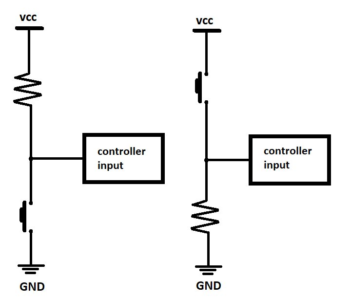

# Lab 2: Control of GPIO, LED, push button

#### Contents

1. [Lab prerequisites](#Lab-prerequisites)


# Lab prerequisites


* **Active-low** - microcontroller is connected to cathode
* **Active-high** - microcontroller is connected to annode

Resistor values:

| **LED color** | **Supply voltage** | **LED current** | **LED voltage** | **Resistor value** |
| :-: | :-: | :-: | :-: | :-: |
| red | 5&nbsp;V | 20&nbsp;mA | 1.8&nbsp;V | 160&nbsp;&Omega; |
| blue | 5&nbsp;V | 20&nbsp;mA | 3&nbsp;V | 100&nbsp;&Omega; |



meaning of the DDRB and PORTB control register values and their combinations.

| **DDRB** | **Description** |
| :-: | :-- |
| 0 | Input pin |
| 1 | Output pin |

| **PORTB** | **Description** |
| :-: | :-- |
| 0 | Output low value |
| 1 | Output high value |

| **DDRB** | **PORTB** | **Direction** | **Internal pull-up resistor** | **Description** |
| :-: | :-: | :-: | :-: | :-- |
| 0 | 0 | Input | No | Tri-state, high-impedance |
| 0 | 1 | Input | Yes | PTB will source current if externally pulled low |
| 1 | 0 | Output | No | Output low (sink) |
| 1 | 1 | Output | No | Output high (source) |


| **Port** | **Pin** | **Input/output usage?** |
| :-: | :-: | :-- |
| A | x | Microcontroller ATmega328P does not contain port A |
| B | 0 | Yes (Arduino pin 8) |
|   | 1 | Yes (Arduino pin 9 active low) |
|   | 2 | Yes (Arduino pin 10 active low) |
|   | 3 | Yes (Arduino pin 11 active low) |
|   | 4 | Yes (Arduino pin 12 active high) |
|   | 5 | Yes (Arduino pin 13 active high, LED active high) |
|   | 6 | No |
|   | 7 | No |
| C | 0 | Yes (Arduino pin A0) |
|   | 1 | Yes (Arduino pin A1) |
|   | 2 | Yes (Arduino pin A2) |
|   | 3 | Yes (Arduino pin A3) |
|   | 4 | Yes (Arduino pin A4) |
|   | 5 | Yes (Arduino pin A5) |
|   | 6 | No |
|   | 7 | No |
| D | 0 | Yes (Arduino pin RX<-0) |
|   | 1 | Yes (Arduino pin TX->1) |
|   | 2 | Yes (Arduino pin 2) |
|   | 3 | Yes (Arduino pin 3 active low) |
|   | 4 | Yes (Arduino pin 4 active high) |
|   | 5 | Yes (Arduino pin 5 active low) |
|   | 6 | Yes (Arduino pin 6 active low) |
|   | 7 | Yes (Arduino pin 7 active high) |

Lab assignment code:

```makefile
/***********************************************************************
 * 
 * Alternately toggle two LEDs when a push button is pressed.
 * ATmega328P (Arduino Uno), 16 MHz, AVR 8-bit Toolchain 3.6.2
 *
 * Inspired by Tomas Fryza
 * Dept. of Radio Electronics, Brno University of Technology, Czechia
 * This work is licensed under the terms of the MIT license.
 * 
 **********************************************************************/

/* Defines -----------------------------------------------------------*/
#define LED_GREEN   PB5     // AVR pin where green LED is connected
#define LED_RED     PC0
#define BTN			PD0
#define BLINK_DELAY 250
#ifndef F_CPU
#define F_CPU 16000000      // CPU frequency in Hz required for delay
#endif

/* Includes ----------------------------------------------------------*/
#include <util/delay.h>     // Functions for busy-wait delay loops
#include <avr/io.h>         // AVR device-specific IO definitions

/* Functions ---------------------------------------------------------*/
/**
 * Main function where the program execution begins. Toggle two LEDs 
 * when a push button is pressed.
 */
int main(void)
{
    /* GREEN LED */
    // Set pin as output in Data Direction Register...
    DDRB = DDRB | (1<<LED_GREEN);
    // ...and turn LED off in Data Register
    PORTB = PORTB & ~(1<<LED_GREEN);

    /* second LED */
    // WRITE YOUR CODE HERE
	DDRC = DDRC | (1<<LED_RED);
	PORTC = PORTC & ~(1<<LED_RED);
	/* button w pullup resistor */
	DDRD = DDRD & ~(1<<BTN);
	PORTD = PORTD | (1<<BTN);
    
	
    while (1)
    {
        // Pause several milliseconds
       // _delay_ms(BLINK_DELAY);
		if (bit_is_clear(PIND, BTN))
		{
		_delay_ms(BLINK_DELAY);
		PORTC = PORTC ^ (1<<LED_RED);
		PORTB = PORTB ^ (1<<LED_GREEN);
		}
		
		while(bit_is_set(PIND, BTN))
		{
			PORTC = PORTC & ~(0<<LED_RED);
			PORTB = PORTB & ~(0<<LED_GREEN);
		}
    }
	
    
    return 0;
}
```
Snapshot of scheme:


## K.I.T.T. front lights code

```maketitle
	/***********************************************************************
	 * 
	 * Alternately toggle two LEDs when a push button is pressed.
	 * ATmega328P (Arduino Uno), 16 MHz, AVR 8-bit Toolchain 3.6.2
	 *
	 * Inspired by Tomas Fryza
	 * Dept. of Radio Electronics, Brno University of Technology, Czechia
	 * This work is licensed under the terms of the MIT license.
	 * 
	 **********************************************************************/

	/* Defines -----------------------------------------------------------*/
	#define BIT(x) (0x01 << (x))
	#define bit_get(p,m) ((p) & (m))
	#define bit_set(p,m) ((p) |= (m))
	#define bit_clear(p,m) ((p) &= ~(m))
	#define LED0   PB0     // AVR pin where green LED is connected
	#define LED1   PB1
	#define LED2   PB2
	#define LED3   PB3
	#define LED4   PB4
	#define LED5   PB5
	#define LED6   PB6
	#define LED7   PB7
	//#define LED_CHCK  PB0
	#define BTN			PD0
	#define BLINK_DELAY 250
	#ifndef F_CPU
	#define F_CPU 16000000      // CPU frequency in Hz required for delay
	#endif

	/* Includes ----------------------------------------------------------*/
	#include <util/delay.h>     // Functions for busy-wait delay loops
	#include <avr/io.h>         // AVR device-specific IO definitions

	/* Functions ---------------------------------------------------------*/
	/**
	 * Main function where the program execution begins. Toggle two LEDs 
	 * when a push button is pressed.
	 */
	int main(void)
	{
		/* Set direction off all pins connected to LEDs */
		DDRB = 0b11111111;
		//turn LEDs off in Data Register
		PORTB = 0b00000000;
		
		/* button w pullup resistor */
		DDRD = DDRD & ~(1<<BTN);
		PORTD = PORTD | (1<<BTN);
		
		//  set a variable for button check
		int8_t BTN_CHCK = 0b0000;
		int8_t n = 0x00;
	
		while (1)
		{
			
			_delay_ms(BLINK_DELAY);
			
			// flip LSb in variable BTN_CHCK if button is pressed
			if(~(bit_get(PORTD, BIT(0))))
			{

				BTN_CHCK ^= 0x01;
				PORTB = 0b11111111;
			}
			// if BTN_CHCK has a nonzero value, start K.I.T.T
			if(bit_get(BTN_CHCK, BIT(0)))
			{
				for(n = 0; n <= 7; n++)
				{
				bit_clear(PORTB, BIT(n));
				_delay_ms(50);
				bit_set(PORTB, BIT(n-1));
				_delay_ms(BLINK_DELAY);
				}
				for(n = 7; n >=0; n--)
				{
					bit_clear(PORTB, BIT(n));
					_delay_ms(50);
					bit_set(PORTB, BIT(n+1));
					_delay_ms(BLINK_DELAY);
				}
				
			}
		}
    
		return 0;
	}
```
