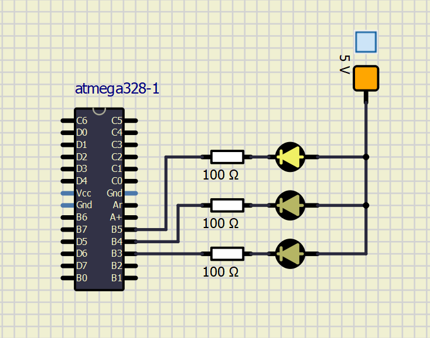

# Lab 4: Interrupts, Timers

### Learning objectives

The purpose of the laboratory exercise is to understand the function of the interrupt, interrupt service routine, and the functionality of 
timer units. Another goal is to practice finding information in the MCU manual; specifically setting timer control registers.

## Table for given 5 prescaler values. 

| **Module** | **Number of bits** | **1** | **8** | **32** | **64** | **128** | **256** | **1024** |
| :-: | :-: | :-: | :-: | :-: | :-: | :-: | :-: | :-: |
| Timer/Counter0 | 8  | 16u | 128u | -- | 1.024m | -- | 4.096ms| 16.384m |
| Timer/Counter1 | 16 | 4.096m | 32.786m | -- | 262m | -- | 1.048 | 4.194 |
| Timer/Counter2 | 8  | 16u | 128u | 512u | 1.024m | 2.048m | 4.096m | 16.384m |

## Connection of LEDs and Push Buttons

| **LED/Button** | **PORT[pin]** |
| :-: | :-: |
| D1 | PB5[13] |
| D2 | PB4[12] |
| D3 | PB3[-11] |
| D4 | PB2[-10] |
| S1-A1 | PC1[A1] |
| S2-A2 | PC2[A2] |
| S3-A3 | PC3[A3] |

## Overview of register for configuration of timer modules

| **Module** | **Operation** | **I/O register(s)** | **Bit(s)** |
| :-: | :-- | :-: | :-- |
| Timer/Counter0 | Prescaler<br><br>8-bit data value<br>Overflow interrupt enable | TCCR0B<br><br>TCNT0<br>TIMSK0 | CS02, CS01, CS00<br>(000: stopped, 001: 1, 010: 8, 011: 64, 100: 256, 101: 1024)<br>TCNT[7:0]<br>TOIE0 (1: enable, 0: disable) |
| Timer/Counter1 | Prescaler<br><br>16-bit data value<br>Overflow interrupt enable | TCCR1B<br><br>TCNT1H, TCNT1L<br>TIMSK1 | CS12, CS11, CS10<br>(000: stopped, 001: 1, 010: 8, 011: 64, 100: 256, 101: 1024)<br>TCNT1[15:0]<br>TOIE1 (1: enable, 0: disable) |
| Timer/Counter2 | Prescaler<br><br>8-bit data value<br>Overflow interrupt enable | TCCR2B<br><br>TCNT2<br>TIMSK2 | CS22, CS21, CS20<br>(000: stopped, 001: 1, 010: 8, 011: 32, 100: 64, 101: 128, 110: 256, 111: 1024)<br>TCNT[7:0]<br>TOIE2 (1: enable, 0: disable) |

## Table of interruption sources

| **Program address** | **Source** | **Vector name** | **Description** |
| :-: | :-- | :-- | :-- |
| 0x0000 | RESET | -- | Reset of the system |
| 0x0002 | INT0  | `INT0_vect`&nbsp;&nbsp;&nbsp;&nbsp;&nbsp;&nbsp;&nbsp;&nbsp;&nbsp;&nbsp;&nbsp;&nbsp;&nbsp;&nbsp;&nbsp;&nbsp; | External interrupt request number 0&nbsp;&nbsp;&nbsp;&nbsp;&nbsp;&nbsp;&nbsp;&nbsp;&nbsp;&nbsp;&nbsp;&nbsp;&nbsp;&nbsp;&nbsp;&nbsp; |
| 0x0004 | INT1 | `INT1_vect` | External interrupt request number 1 |
| 0x0006 | PCINT0 | `PCINT0_vect` | Pin change interrupt Request 0 |
| 0x0008 | PCINT1 | `PCINT1_vect` | Pin Change Interrupt Request 1 |
| 0x000A | PCINT2 | `PCINT2_vect` | Pin Change Interrupt Request 2 |
| 0x000C | WDT | -- | Watchdog Time-out Interrupt |
| 0x0012 | TIMER2_OVF | `TIMER2_OVF_vect` | Timer/counter 2 Overflow |
| 0x0018 | TIMER1_COMPB | `TIMER1_COMPB_vect` | Compare match between Timer/Counter1 value and channel B compare value |
| 0x001A | TIMER1_OVF | `TIMER1_OVF_vect` | Overflow of Timer/Counter1 value |
| 0x0020 | TIMER0_OVF | `TIMER0_OVF_vect` | Timer/Counter 0 Overflow |
| 0x0024 | USART_RX | -- | USART Rx Complete |
| 0x002A | ADC | `ADC_vect` | ADC Conversion Complete |
| 0x0030 | TWI | `TWI_vect` | 2-wire Serial Interface |

## Table of Arduino pins that can be used to generate PWM signal

| **Module** | **Description** | **MCU pin** | **Arduino pin** |
| :-: | :-: | :-: | :-: |
| Timer/Counter0 | OC0A |   PD6  |  6  |
|                | OC0B |   PD5  |  5  |
| Timer/Counter1 | OC1A |  PB1   |  9  |
|                | OC1B | PB2 | 10 |
| Timer/Counter2 | OC2A |  PB3   |  11  |
|                | OC2B |   PD3  |  3  |

## Listing of library header file `timer.h`

```Makefile
/* Defines -----------------------------------------------------------*/
/**
 * @brief Defines prescaler CPU frequency values for Timer/Counter0.
 * @note  F_CPU = 16 MHz
  */
 #define TIM0_stop()             TCCR0B &= ~((1<<CS02) | (1<<CS01) | (1<<CS00));
 #define TIM0_overflow_16us()     TCCR0B &= ~((1<<CS02) | (1<<CS01)); TCCR0B |= (1<<CS00);
 #define TIM0_overflow_128us()    TCCR0B &= ~((1<<CS02) | (1<<CS00)); TCCR0B |= (1<<CS01);
 #define TIM0_overflow_1ms()   TCCR0B &= ~(1<<CS02); TCCR0B |= (1<<CS01) | (1<<CS00);
 #define TIM0_overflow_4ms()      TCCR0B &= ~((1<<CS01) | (1<<CS00)); TCCR0B |= (1<<CS02);
 #define TIM0_overflow_16ms()      TCCR0B &= ~(1<<CS01); TCCR0B |= (1<<CS02) | (1<<CS00);
/**
 * @brief Defines interrupt enable/disable modes for Timer/Counter0.
 */
#define TIM0_overflow_interrupt_enable()    TIMSK0 |= (1<<TOIE0);
#define TIM0_overflow_interrupt_disable()   TIMSK0 &= ~(1<<TOIE0);
/**
 * @brief Defines prescaler CPU frequency values for Timer/Counter1.
 * @note  F_CPU = 16 MHz
  */
#define TIM1_stop()             TCCR1B &= ~((1<<CS12) | (1<<CS11) | (1<<CS10));
#define TIM1_overflow_4ms()     TCCR1B &= ~((1<<CS12) | (1<<CS11)); TCCR1B |= (1<<CS10);
#define TIM1_overflow_33ms()    TCCR1B &= ~((1<<CS12) | (1<<CS10)); TCCR1B |= (1<<CS11);
#define TIM1_overflow_262ms()   TCCR1B &= ~(1<<CS12); TCCR1B |= (1<<CS11) | (1<<CS10);
#define TIM1_overflow_1s()      TCCR1B &= ~((1<<CS11) | (1<<CS10)); TCCR1B |= (1<<CS12);
#define TIM1_overflow_4s()      TCCR1B &= ~(1<<CS11); TCCR1B |= (1<<CS12) | (1<<CS10);

/**
 * @brief Defines interrupt enable/disable modes for Timer/Counter1.
 */
#define TIM1_overflow_interrupt_enable()    TIMSK1 |= (1<<TOIE1);
#define TIM1_overflow_interrupt_disable()   TIMSK1 &= ~(1<<TOIE1);

/**
 * @brief Defines prescaler CPU frequency values for Timer/Counter1.
 * @note  F_CPU = 16 MHz
  */
#define TIM2_stop()             TCCR2B &= ~((1<<CS22) | (1<<CS21) | (1<<CS20));
#define TIM2_overflow_16us()     TCCR2B &= ~((1<<CS22) | (1<<CS21)); TCCR2B |= (1<<CS20);
#define TIM2_overflow_128us()    TCCR2B &= ~((1<<CS22) | (1<<CS20)); TCCR2B |= (1<<CS21);
#define TIM2_overflow_512us()	TCCR2B &= ~(1<<CS22); TCCR2B |= (1<<CS21) | (1<<CS20);
#define TIM2_overflow_1ms()   TCCR2B &= ~((1<<CS21) | (1<<CS20)); TCCR2B |= (1<<CS22);
#define TIM2_overflow_2ms()		TCCR2B &= ~(1<<CS21); TCCR2B |= (1<<CS22) | (1<<CS20);
#define TIM2_overflow_4ms()      TCCR2B &= ~(1<<CS20); TCCR2B |= (1<<CS22) | (1<<CS21);
#define TIM2_overflow_16ms()      TCCR2B |= ((1<<CS22) | (1<<CS21) | (1<<CS20));

/**
 * @brief Defines interrupt enable/disable modes for Timer/Counter1.
 */
#define TIM2_overflow_interrupt_enable()    TIMSK2 |= (1<<TOIE2);
#define TIM2_overflow_interrupt_disable()   TIMSK2 &= ~(1<<TOIE2);
#endif	
```

## Complete code of `main.c`

```Makefile
/***********************************************************************
 * 
 * Control LEDs using functions from GPIO and Timer libraries. Do not 
 * use delay library any more.
 * ATmega328P (Arduino Uno), 16 MHz, AVR 8-bit Toolchain 3.6.2
 *
 * Copyright (c) 2018-2020 Tomas Fryza
 * Dept. of Radio Electronics, Brno University of Technology, Czechia
 * This work is licensed under the terms of the MIT license.
 * 
 **********************************************************************/

/* Defines -----------------------------------------------------------*/
#define LED_D1  PB5
#define LED_D2  PB4
#define LED_D3  PB3

/* Includes ----------------------------------------------------------*/
#include <avr/io.h>         // AVR device-specific IO definitions
#include <avr/interrupt.h>  // Interrupts standard C library for AVR-GCC
#include "gpio.h"           // GPIO library for AVR-GCC
#include "timer.h"          // Timer library for AVR-GCC

/* Function definitions ----------------------------------------------*/
/**
 * Main function where the program execution begins. Toggle three LEDs
 * on Multi-function shield with internal 8- and 16-bit timer modules.
 */
int main(void)
{
    /* Configuration of three LEDs */
    
    GPIO_config_output(&DDRB, LED_D1);
    GPIO_write_low(&PORTB, LED_D1);
	GPIO_config_output(&DDRB, LED_D2);
	GPIO_write_low(&PORTB, LED_D2);
	GPIO_config_output(&DDRB, LED_D3);
	GPIO_write_low(&PORTB, LED_D3);

    /* Configuration of 8-bit Timer/Counter0 */
    TIM0_overflow_16ms();
	TIM0_overflow_interrupt_enable();

    /* Configuration of 16-bit Timer/Counter1
     * Set prescaler and enable overflow interrupt */
    TIM1_overflow_262ms();
    TIM1_overflow_interrupt_enable();

    /* Configuration of 8-bit Timer/Counter2 */
    TIM2_overflow_4ms();
	TIM2_overflow_interrupt_enable();

    // Enables interrupts by setting the global interrupt mask
    sei();

    // Infinite loop
    while (1)
    {
        /* Empty loop. All subsequent operations are performed exclusively 
         * inside interrupt service routines ISRs */
    }

    // Will never reach this
    return 0;
}

/* Interrupt service routines ----------------------------------------*/
/**
 * ISR starts when Timer/Counter1 overflows. Toggle LED D2 on 
 * Multi-function shield. */
ISR(TIMER1_OVF_vect)
{
    GPIO_toggle(&PORTB, LED_D1);
	
}
ISR(TIMER0_OVF_vect)
{
	GPIO_toggle(&PORTB, LED_D2);
}
ISR(TIMER2_OVF_vect)
{
	GPIO_toggle(&PORTB, LED_D3);
}
```

Screenshot of SimulIDE:


## Difference between a regular C function and interrupt service routine
Firstly, a common C function has determined conditions for it to be called, whereas ISR  is called at anytime, when a hardware interrupt occurs. ISRs are controlled by a coprocessor. When a coprocessor registers a hardware input, it allerts the processor via kernel service which saves its current state for later and executes the related interrupt code. Then the main processor countinues in its previous task. 
    Also ISRs do not, on opposition to common functions, return values and also cannot have arguments passed on them.

## 8-bit Timer Counter0 with PWM - Modes of Operation

### Normal Mode
In this mode, the counter is always incrementing without clearing itself (in other words repeats itself). The TOV0 flag sets itself, when counter becomes zero (acts as a ninth bit), thus it doesn't reset itself. Reseting the flag can be accomplished by combining with the timer overflow interrupt. 

### Clear Timer on Compare Match (CTC) Mode
The resolution of the timer is set by OCR0A register value. The timer resets, when its value matches mentioned registers value.

### Fast PWM Mode 
Option suitable for a high frequency PWM waveform generation. The counter counts form BOTTOM value and restarts at the TOP value back to BOTTOM. Value of TOP depends on WGM2:0 value. Fastest of all, suitable for power regulation, rectification and DAC applications.

### Phase Correct PWM Mode
Provides a high resolution phase correct PWM waveform generation based on dual-slope operation. Based on the polarity of wave formation (inverted *x* non-inverted) increments from BOTTOM to TOP and decrements from TOP to BOTTOM or the other way around.


