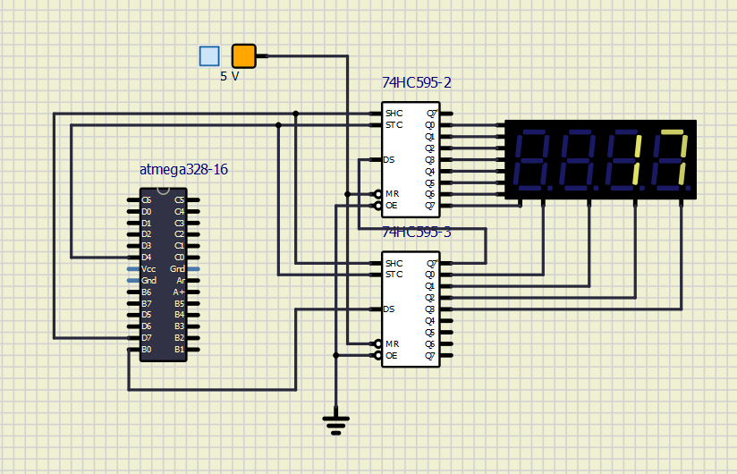

# Lab 5: Display devices, 7-segment display

## Difference between Common Cathode and Common anode 7-segment display	
Common cathode connection has all cathodes connected to ground, therefore a segment is lit, when there is high voltage on its annode pin (source mode). Common anode works the other way around. 
Anodes of all segments are interconnected to source of high voltage and cathodes are connested to signal source. A segment is lit, when there is low voltage, logical zero, on cathode pin (sink mode).

Binary values of the segments for display 0 to 9 on a common anode 7-segment display:

   | **Digit** | **A** | **B** | **C** | **D** | **E** | **F** | **G** | **DP** |
   | :-: | :-: | :-: | :-: | :-: | :-: | :-: | :-: | :-: |
   | 0 | 0 | 0 | 0 | 0 | 0 | 0 | 1 | 1 |
   | 1 | 1 | 0 | 0 |  1 | 1  |  1 | 1  | 1 |
   | 2 | 0  | 0  | 1  | 0  | 0  |  1 |  0 | 1 |
   | 3 | 0 | 0 | 0 | 0 | 1 | 1 | 0 | 1 |
   | 4 | 1  | 0  |  0 | 1  |  1 |  0 | 0  | 1 |
   | 5 |  0 |  1 |  0 | 0  | 1  | 0  |  0 | 1 |
   | 6 |  0 |  1 |  0 |  0 | 0  | 0  |  0| 1 |
   | 7 |  0 |  0 |  0 | 1  | 1 | 1  |  1 | 1 |
   | 8 | 0  | 0  |  0 | 0  |  0 | 0  | 0 | 1 |
   | 9 |  0 |  0 |  0 |  0 | 1  | 0 | 0  | 1 |
   
Connection of seven segment display:


| **7seg pin** | **shift register** | **register pin** |
| :-: | :-: | :-: |
| A.1 (12) | U2 | QA (15) |
| A.2 (9)  | U2 | QB (1)  |
| A.3 (8)  | U2 | QC (2)  |
| A.4 (6)  | U2 | QD (3)  |
|  a (11)  | U3 | QA (15) |
|  b (7)   | U3 | QB (1)  |
|  d (2)   | U3 | QD (3)  |
|  c (4)   | U3 | QC (2)  |
|  e (1)   | U3 | QE (4)  |
|  f (10)  | U3 | QF (5)  |
|  g (5)   | U3 | QG (6)  |
| DP (3)   | U3 | QH (7)  |

	
Purpose of two shift registers:
	
The purpose of shift registers 74HC595-U2 is to, based on clock timing, shift between consecutive 7-segment displays. Only one is lit at any  given moment, which is not perceivable to human eye. Human sight "refreshes" at much 
slower pace, thus creating the illusion, that all displays are lit at once. The other shift register, 74HC595-U3, gives the information of which segments are to be lit in order to
show desired symbol, refreshed at the same frequency as aforementioned register.

## segment.c file

```Makefile
/***********************************************************************
 * 
 * Seven-segment display library for AVR-GCC.
 * ATmega328P (Arduino Uno), 16 MHz, AVR 8-bit Toolchain 3.6.2
 *
 * Copyright (c) 2019-2020 Tomas Fryza
 * Dept. of Radio Electronics, Brno University of Technology, Czechia
 * This work is licensed under the terms of the MIT license.
 *
 **********************************************************************/

#define F_CPU 16000000


/* Includes ----------------------------------------------------------*/
#include <util/delay.h>
#include "gpio.h"
#include "segment.h"
//Snake segments
uint8_t snake[] =
{
	0b01111111, // 1st step - A
	0b00111111, // 2nd step - A and B
	0b10111111, // 3 - B
	0b10011111, // 4 - B & C
	0b11011111, // 5 - C
	0b11001111, // 6 - C & D
	0b11101111, // 7 - D
	0b11100111, // 8 - D & E
	0b11110111, // 9 - E
	0b11110011, // 10 - E & F
	0b11111011, // 11 - F
	0b01111011 // 12 - F & A
	
};
//Active-low digits 0 to 9
uint8_t segment_value[] =
{
	//abcdefgDP
	0b00000011, // 0
	0b10011111, // 1
	0b00100101, // 2
	0b00001101, // 3
	0b10011001, // 4
	0b01001001, // 5
	0b01000001, // 6
	0b00011111, // 7
	0b00000001, // 8
	0b00001001  // 9
};

// Active-high position 0 to 3
uint8_t segment_position[] =
{
	// p3 p2 p1 p0
	0b00010000,   // position 0
	0b00100000,   // position 1
	0b01000000,   // position 2
	0b10000000   // position 3
};
/* Function definitions ----------------------------------------------*/
void SEG_init(void)
{
    /* Configuration of SSD signals */
    GPIO_config_output(&DDRD, SEGMENT_LATCH);
    GPIO_config_output(&DDRD, SEGMENT_CLK);
    GPIO_config_output(&DDRB, SEGMENT_DATA);
}

/*--------------------------------------------------------------------*/
void SEG_update_shift_regs(uint8_t segments, uint8_t position)
{
    uint8_t bit_number;
	segments = segment_value[segments];     // 0, 1, ..., 9
	position = segment_position[position];  // 0, 1, 2, 3

    // Pull LATCH, CLK, and DATA low
	
	GPIO_write_low(&PORTD, SEGMENT_LATCH);
	GPIO_write_low(&PORTD, SEGMENT_CLK);
	GPIO_write_low(&PORTB, SEGMENT_DATA);

    // Wait 1 us
	_delay_us(1);
	
    // Loop through the 1st byte (segments)
    // a b c d e f g DP (active low values)
    for (bit_number = 0; bit_number < 8; bit_number++)
    {
        // Output DATA value (bit 0 of "segments")
		if ((segments % 2) == 0)
		{
			GPIO_write_low(&PORTB, SEGMENT_DATA);
		}
		else
		{
			GPIO_write_high(&PORTB, SEGMENT_DATA);
		}
        // Wait 1 us
		_delay_us(1);
        // Pull CLK high
		GPIO_write_high(&PORTD, SEGMENT_CLK);

        // Wait 1 us
		_delay_us(1);
        // Pull CLK low
		GPIO_write_low(&PORTD, SEGMENT_CLK);
        // Shift "segments"
        segments = segments >> 1;
    }

    // Loop through the 2nd byte (position)
    // p3 p2 p1 p0 . . . . (active high values)
    for (bit_number = 0; bit_number < 8; bit_number++)
    {
        // Output DATA value (bit 0 of "position")
		if ((position & 1) == 0)
		{
			GPIO_write_low(&PORTB, SEGMENT_DATA);
		}
		else
		{
			GPIO_write_high(&PORTB, SEGMENT_DATA);
		}
        // Wait 1 us
	_delay_us(1);
        // Pull CLK high
		GPIO_write_high(&PORTD, SEGMENT_CLK);
        // Wait 1 us
	_delay_us(1);
        // Pull CLK low
		GPIO_write_low(&PORTD, SEGMENT_CLK);
        // Shift "position"
        position = position >> 1;
    }

    // Pull LATCH high
	GPIO_write_high(&PORTD, SEGMENT_LATCH);
    // Wait 1 us
	_delay_us(1);
}

/*--------------------------------------------------------------------*/
/* SEG_clear */
void SEG_clear(void)
{
	 uint8_t bit_number = 0;
	 uint8_t segments = 0b11111111;
	 uint8_t position = 0;

	 // Pull LATCH, CLK, and DATA low
	 
	 GPIO_write_low(&PORTD, SEGMENT_LATCH);
	 GPIO_write_low(&PORTD, SEGMENT_CLK);
	 GPIO_write_low(&PORTB, SEGMENT_DATA);

	 // Wait 1 us
	 _delay_us(1);
	 
	 // Loop through the 1st byte (segments)
	 // a b c d e f g DP (active low values)
	 for (bit_number = 0; bit_number < 8; bit_number++)
	 {
		 // turn segment off
			 GPIO_write_high(&PORTB, SEGMENT_DATA);
		
		 // Wait 1 us
		 _delay_us(1);
		 // Pull CLK high
		 GPIO_write_high(&PORTD, SEGMENT_CLK);

		 // Wait 1 us
		 _delay_us(1);
		 // Pull CLK low
		 GPIO_write_low(&PORTD, SEGMENT_CLK);
		 // Shift "segments"
		 segments = segments >> 1;
		 
		     // Loop through the 2nd byte (position)
		     // p3 p2 p1 p0 . . . . (active high values)
		     for (bit_number = 0; bit_number < 8; bit_number++)
		     {
			     // Output DATA value (bit 0 of "position")
			     if ((position & 1) == 0)
			     {
				     GPIO_write_low(&PORTB, SEGMENT_DATA);
			     }
			     else
			     {
				     GPIO_write_high(&PORTB, SEGMENT_DATA);
			     }
			     // Wait 1 us
			     _delay_us(1);
			     // Pull CLK high
			     GPIO_write_high(&PORTD, SEGMENT_CLK);
			     // Wait 1 us
			     _delay_us(1);
			     // Pull CLK low
			     GPIO_write_low(&PORTD, SEGMENT_CLK);
			     // Shift "position"
			     position = position >> 1;
		     }

		     // Pull LATCH high
		     GPIO_write_high(&PORTD, SEGMENT_LATCH);
		     // Wait 1 us
		     _delay_us(1);
	     
}
/*--------------------------------------------------------------------*/
/* SEG_clk_2us */
void SEG_clk_2us(void)
{
	//wait 1 us
	_delay_us(1);
	
	//pull CLK high
	GPIO_write_high(&PORTD, SEGMENT_CLK);
	
	//wait 1 us
	_delay_us(1);
	
	//pull CLK low
	GPIO_write_low(&PORTD, SEGMENT_CLK);
}
```
## main.c 

```Makefile
/***********************************************************************
 * 
 * Decimal counter with 7-segment output.
 * ATmega328P (Arduino Uno), 16 MHz, AVR 8-bit Toolchain 3.6.2
 *
 * Copyright (c) 2018-2020 Tomas Fryza
 * Dept. of Radio Electronics, Brno University of Technology, Czechia
 * This work is licensed under the terms of the MIT license.
 * 
 **********************************************************************/

/* Includes ----------------------------------------------------------*/
#include <avr/io.h>         // AVR device-specific IO definitions
#include <avr/interrupt.h>  // Interrupts standard C library for AVR-GCC
#include "timer.h"          // Timer library for AVR-GCC
#include "segment.h"        // Seven-segment display library for AVR-GCC

uint8_t decimal = 0;
uint8_t units = 0;
/* Function definitions ----------------------------------------------*/
/**
 * Main function where the program execution begins. Display decimal 
 * counter values on SSD (Seven-segment display) when 16-bit 
 * Timer/Counter1 overflows.
 */
int main(void)
{
    // Configure SSD signals
    SEG_init();

    // Test of SSD: display number '3' at position 0
    SEG_update_shift_regs(0b00001101, 0b00010000);

    /* Configure 16-bit Timer/Counter1
     * Set prescaler and enable overflow interrupt */
	TIM1_overflow_1s();
	TIM1_overflow_interrupt_enable();
	
	
	/* Configure 8-bit Timer/Counter1
     * Set prescaler and enable overflow interrupt */
	TIM0_overflow_4ms();
	TIM0_overflow_interrupt_enable();
    // Enables interrupts by setting the global interrupt mask
	sei();
    // Infinite loop
    while (1)
    {
        /* Empty loop. All subsequent operations are performed exclusively 
         * inside interrupt service routines ISRs */
    }

    // Will never reach this
    return 0;
}

/* Interrupt service routines ----------------------------------------*/
/**
 * ISR starts when Timer/Counter0 overflows. Display values on SSD
 */
ISR(TIMER0_OVF_vect)
{
    static uint8_t pos = 0;
	
	if (pos == 0)
	{
		SEG_update_shift_regs(units, pos);
		pos = 1;
	}
	else
	{
		SEG_update_shift_regs(decimal, pos);
		pos = 0;
	}
	
}
/**
 * ISR starts when Timer/Counter1 overflows. Increment decimal counter
 * value and display it on SSD.
 */
ISR(TIMER1_OVF_vect)
{
    units++;
	
	if(	units > 9) {
		units = 0;
		decimal++;
		if ( decimal > 5)
		decimal = 0;
	}
	
}

```

## Snapshot of Simulation


## main.c of snake application

```Makefile
/***********************************************************************
 * 
 * Decimal counter with 7-segment output.
 * ATmega328P (Arduino Uno), 16 MHz, AVR 8-bit Toolchain 3.6.2
 *
 * Copyright (c) 2018-2020 Tomas Fryza
 * Dept. of Radio Electronics, Brno University of Technology, Czechia
 * This work is licensed under the terms of the MIT license.
 * 
 **********************************************************************/

/* Includes ----------------------------------------------------------*/
#include <avr/io.h>         // AVR device-specific IO definitions
#include <avr/interrupt.h>  // Interrupts standard C library for AVR-GCC
#include "timer.h"          // Timer library for AVR-GCC
#include "segment.h"        // Seven-segment display library for AVR-GCC
uint8_t snake = 0;
uint8_t pos = 0;

/* Function definitions ----------------------------------------------*/
/**
 * Main function where the program execution begins. Display decimal 
 * counter values on SSD (Seven-segment display) when 16-bit 
 * Timer/Counter1 overflows.
 */
int main(void)
{
    // Configure SSD signals
    SEG_init();

    // Test of SSD: display number '3' at position 0
  //  SEG_update_shift_regs(0b00001101, 0b00010000);

    /* Configure 16-bit Timer/Counter1
     * Set prescaler and enable overflow interrupt */
	TIM1_overflow_1s();
	TIM1_overflow_interrupt_enable();
	
	
	/* Configure 8-bit Timer/Counter1
     * Set prescaler and enable overflow interrupt */
	TIM0_overflow_4ms();
	TIM0_overflow_interrupt_enable();
    // Enables interrupts by setting the global interrupt mask
	sei();
    // Infinite loop
    while (1)
    {
        /* Empty loop. All subsequent operations are performed exclusively 
         * inside interrupt service routines ISRs */
    }

    // Will never reach this
    return 0;
}

/* Interrupt service routines ----------------------------------------*/
/**
 * ISR starts when Timer/Counter0 overflows. Display values on SSD
 */
ISR(TIMER0_OVF_vect)
{
		
		SEG_update_shift_regs(snake, pos);
	
}
/**
 * ISR starts when Timer/Counter1 overflows. Increment decimal counter
 * value and display it on SSD.
 */
ISR(TIMER1_OVF_vect)
{
    snake++;
	
	if(	snake > 12) {
		snake = 0;
	}
	
}
```