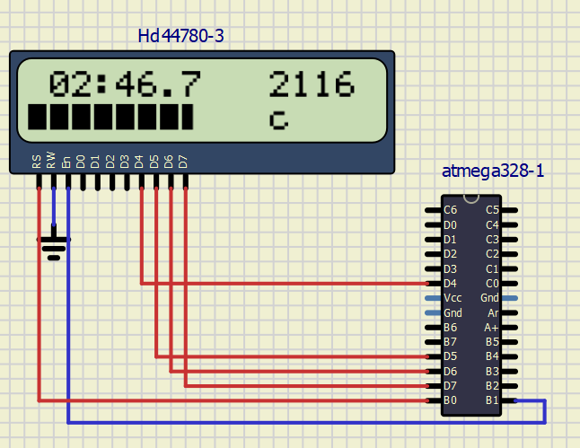

# Lab 6: Display devices, LCD display

## Connection of LCD pins and meaning of affiliated signals

  | **LCD signal(s)** | **AVR pin(s)** | **Description** |
   | :-: | :-: | :-- |
   | RS | PB0 | Register selection signal. Selection between Instruction register (RS=0) and Data register (RS=1) |
   | R/W | GND | Read/Write selection |
   | E | PB1 | Enable |
   | D[3:0] | Not connected | Lower nibble for data byte |
   | D[7:4] | PD[7-4] | Higher nibble for data byte |
## ASCII
ASCII is American Standard Code for Information Interchange. It is a table treating english characters and other mostly used characters.
Values for uppercase 'A' to 'Z' are 0x40 to 0x5a, 'a' to 'z' are 0x61 to 0x7a, '0' to '9' are 0x30 to 0x39.

## Input parameters and description of the functions

   | **Function name** | **Function parameters** | **Description** | **Example** |
   | :-- | :-- | :-- | :-- |
   | `lcd_init` | `LCD_DISP_OFF`<br>`LCD_DISP_ON`<br>`LCD_DISP_ON_CURSOR`<br>`LCD_DISP_ON_CURSOR_BLINK` | Display off&nbsp;&nbsp;&nbsp;&nbsp;&nbsp;&nbsp;&nbsp;&nbsp;&nbsp;&nbsp;&nbsp;&nbsp;&nbsp;&nbsp;&nbsp;&nbsp;&nbsp;&nbsp;&nbsp;&nbsp;&nbsp;&nbsp;&nbsp;&nbsp;&nbsp;&nbsp;&nbsp;&nbsp;&nbsp;&nbsp;&nbsp;&nbsp;&nbsp;&nbsp;&nbsp;&nbsp;&nbsp;&nbsp;&nbsp;&nbsp;&nbsp;&nbsp;&nbsp;&nbsp;&nbsp;<br>&nbsp;<br>&nbsp;<br>&nbsp; | `lcd_init(LCD_DISP_OFF);`<br>&nbsp;<br>&nbsp;<br>&nbsp; |
   | `lcd_clrscr` | `VOID`| Clear display and set cursor to home position | `lcd_clrscr();` |
   | `lcd_gotoxy` | `x`(horizontal position)<br>`y(vertical position)` | Set cursor to specified position &nbsp;<br>&nbsp;| `lcd_gotoxy();`&nbsp;<br>&nbsp; |
   | `lcd_putc` | `c`(single character) | Display character at current cursor position | `lcd_putc('k');` |
   | `lcd_puts` | `a`(string) | Display string from program memory without auto linefeed | `lcd_puts(string_variable);` |
   | `lcd_command` | `cmd`(instruction to send to LCD controller | Send data byte to LCD controller | `lcd_command(1 << LCD_DDRAM);` |
   | `lcd_data` | `data`(byte to send to LCD controller) | Send data byte to LCD controller | `lcd_data(customChar[i]);` |
  
## Picture of time signals between ATmega328P and HD44780


##Listing of TIMER2_OVF_vect interrupt routine with complete stopwatch code (minutes:seconds.tenths) and square value computation

```Makefile
ISR(TIMER2_OVF_vect)
{
    static uint8_t number_of_overflows = 0;
	static uint8_t tens = 0;
	static uint8_t secs = 00;
	static uint8_t mins = 0;
	uint16_t sq_mins = secs * secs;	
	
	char LCD_string[2] = "  ";
	char sq_string[4] = "    ";

    number_of_overflows++;
    if (number_of_overflows >= 6)
    {
        // Do this every 6 x 16 ms = 100 ms
        number_of_overflows = 0;
		tens++;
		if(tens > 9)
		{
			tens = 0;
			secs++;
		}
		if(secs > 59)
		{
			secs = 0;
			lcd_gotoxy(11,0);
			lcd_putc(32);
			lcd_putc(32);
			lcd_putc(32);
			lcd_putc(32);
			sq_mins = 0;
			mins++;
		}
		if(mins > 59)
		{
			mins = 0;
		}

		itoa(tens, LCD_string, 10);
		lcd_gotoxy(7,0);
		lcd_puts(LCD_string);
		if(secs < 10)
		{
			itoa(secs, &LCD_string[1],10);
			LCD_string[0] = '0';
		}
		if(secs > 9)
		{
			itoa(secs, &LCD_string[0],10);
		}
		lcd_gotoxy(4, 0);
		lcd_puts(LCD_string);
		if(mins < 10)
		{
			itoa(mins, &LCD_string[1],10);
			LCD_string[0] = '0';
		}
		if(mins > 9)
		{
			itoa(mins, &LCD_string[0],10);
		}
		lcd_gotoxy(1, 0);
		lcd_puts(LCD_string);
		// print square of mins to screen
		itoa(sq_mins, sq_string, 10);
		lcd_gotoxy(11,0);
		lcd_puts(sq_string);
    }

}
```

## Listing of TIMER0_OVF_vect interrupt routine with a progress bar

```Makefile
ISR(TIMER0_OVF_vect)
{
	static uint8_t bar = 0;
	static uint8_t pos = 0;
	static uint8_t symbol[6] = {32, 0, 1, 2, 3, 255};
	lcd_gotoxy(pos, 1);
	lcd_putc(symbol[bar]);
	bar++;
	
	if(bar > 5)
	{
		pos++;
		bar = 0;
	}
	if( pos > 9)
	{
		pos = 0;
		bar = 0;
		lcd_gotoxy(0,1);
		for(int i = 0; i < 10; i++)
		{
			lcd_putc(32);
		}
	}
}
```

## Screenshot of SimulIDE circuit when "Power Circuit" is applied

