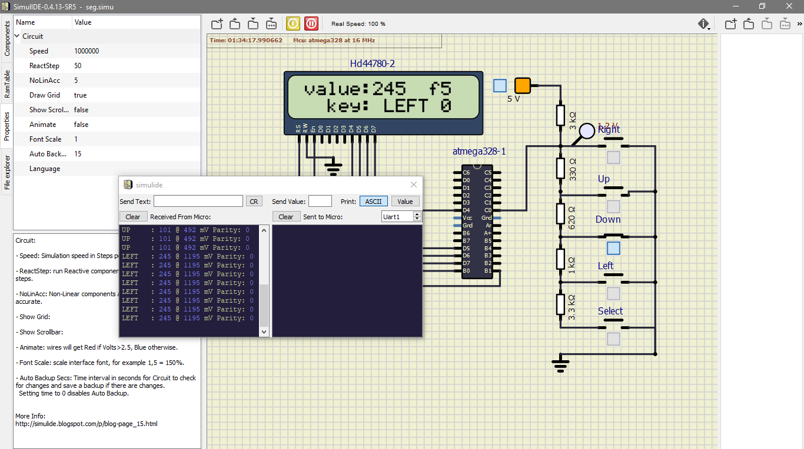
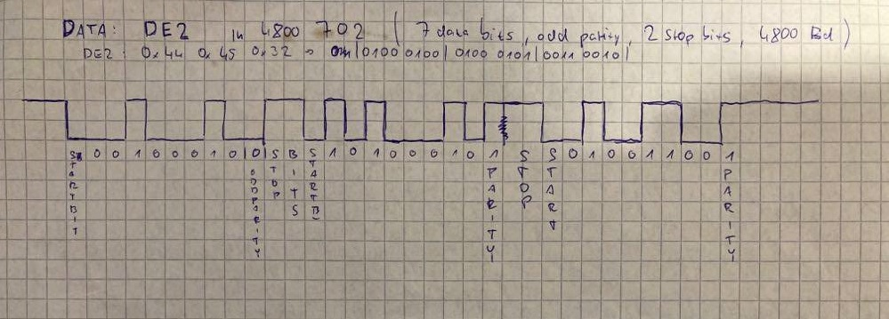

# Lab 7: ADC, serial communication, UART

## Lab prerequisites

### Connection of five push buttons: Select, Left, Up, Down, and Right on [LCD keypad shield](../../Docs/arduino_shield.pdf)

All buttons have common ground and are connected to a signle pin through voltage divider. 
Which button is pressed is distinguished by the voltage on the output pin.

### Voltage value on pin PC0[A0] if one button is pressed at a time

 | **Push button** | **PC0[A0] voltage** | **ADC value (calculated)** | **ADC value (measured)** |
   | :-: | :-: | :-: | :-: |
   | Right  | 0&nbsp;V | 0   |  |
   | Up     | 0.495&nbsp;V | 101 |  |
   | Down   | 1.203&nbsp;V | 246 |  |
   | Left   | 1.969&nbsp;V | 402 |  |
   | Select | 3.182&nbsp;V | 651 |  |
   | none   | 5&nbsp;V | 1023 |  |

### Table for ADC converter register

   | **Operation** | **Register(s)** | **Bit(s)** | **Description** |
   | :-: | :-- | :-- | :-- |
   | Voltage reference | ADMUX | REFS1:0 | 01: AVcc voltage reference, 5V |
   | Input channel | ADMUX | MUX3:0 | 0000: ADC0, 0001: ADC1, ... |
   | ADC enable | ADCSRA | ADEN | 1: ADC Enable, 0: ADC Disable |
   | Start conversion | ADCSRA | ADSC | 1:Start conversion, when conversion complete, returns to zero |
   | ADC interrupt enable | ADCSRA | ADIE | 1: first bit in SREG is set and the ADC Conversion Complete Interrupt is activated |
   | ADC clock prescaler | ADCSRA | ADPS2:0 | 000: Division factor 2, 001: 2, 010: 4, ...|
   | ADC result | ADC | ADCL7:0 and ADCH7:0 | conversion result |
   
### UART description table

   | **Function name** | **Function parameters** | **Description** | **Example** |
   | :-- | :-- | :-- | :-- |
   | `uart_init` | `UART_BAUD_SELECT(9600, F_CPU)` | Initialize UART to 8N1 and set baudrate to 9600&nbsp;Bd | `uart_init(UART_BAUD_SELECT(9600, F_CPU));` |
   | `uart_getc` | void | Get received byte from ringbuffer | `uart_getc();` |
   | `uart_putc` | data(byte) | Put byte to ring buffer | `uart_putc('c');` |
   | `uart_puts` | pointer to string | Put string to ringbuffer | `uart_puts(lcd_string);` |

### Listing of `ADC_vector` interrupt routine

```Makefile
ISR(ADC_vect)
{
	 static char buttons[5][7] = 
	{
		"RIGHT ",
		"UP    ",
		"LEFT  ",
		"DOWN  ",
		"SELECT"
	};
	static char current_button[7];
    uint16_t value = 0;
    char lcd_string[4] = "    ";
	value = ADC;    // Copy ADC result to 16-bit variable
	lcd_gotoxy(7, 0);
	lcd_puts(lcd_string);
    itoa(value, lcd_string, 10);    // Convert to string in decimal
	lcd_gotoxy(7, 0);
	lcd_puts(lcd_string);
	lcd_gotoxy(12, 0);
	lcd_puts("   ");
	lcd_gotoxy(12, 0);
	itoa(value, lcd_string, 16);
	lcd_puts(lcd_string);
	if(value < 50)
	{
		for(int i = 0; i <= 7; i++)
		{
		current_button[i] = buttons[0][i];
		}
	}
	else if((value > 50) && (value < 180))
	{
		for(int i = 0; i <= 7; i++)
		{
			current_button[i] = buttons[1][i];
		}
	}
	else if((value > 180) && (value < 300))
	{
		for(int i = 0; i <= 7; i++)
		{
			current_button[i] = buttons[2][i];
		}
	}
	else if((value > 300) && (value < 500))
	{
		for(int i = 0; i <= 7; i++)
		{
			current_button[i] = buttons[3][i];
		}
	}
	else if((value > 500) && (value < 800))
	{
		for(int i = 0; i <= 7; i++)
		{
			current_button[i] = buttons[4][i];
		}
	}
	else
	{
		for(int i = 0; i <= 7; i++)
		{
			current_button[i] = ' ';
		}
	}
	uint16_t Voltage = value * 4.88;
	lcd_gotoxy(8, 1);
	lcd_puts(current_button);
	if(value < 1010)
	{
		uart_puts(current_button);
		uart_puts(" : ");
		itoa(value, lcd_string, 10);
		uart_puts(lcd_string);
		uart_puts(" @ ");
		itoa(Voltage, lcd_string, 10);
		uart_puts(lcd_string);
		uart_puts(" mV");
		uart_puts(" Parity: ");
		uint8_t parity = func_parity(value);
		lcd_gotoxy(13, 1);
		itoa(parity, lcd_string, 2);
		lcd_puts(lcd_string);
		uart_puts(lcd_string);
		uart_puts("\r\n");
	}
}
```

### Screenshot of SimulIDE:



### Hand drawn picture of UART signal



### Listing of code for calculating parity bit ( displaying is in part above)

```Makefile
	int8_t func_parity( uint16_t n)
	{
		uint8_t parity = 0;
		while(n)
		{
			parity = !parity;
			n = n & (n-1);
		}
		return parity;
	}
```

