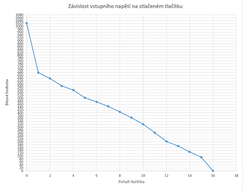

# Generátor signálů a tónové volby DTMF 

### Členové týmu

Na práci se podíleli Martin Eiláš a Josef Hůla.

[GIT repozitář](https://github.com/xhulaj/Digital-electronics-2/tree/master/Labs/project)

### Cíle projektu

Výsledná implementace umí generovat různé typy signálů o nastavitelné frekvenci a zároveň tónovou volbu (DTMF). 
Po implementaci na cílové zařízení se stanovenými periferiemi komunikuje s uživatelem pomocí klávesnice 4x4, LCD 
displeje a s ostatními zařízeními pomocí komunikace UART.

## Popis hardwarového rozhraní

Kód je implementován na desce Arduino Uno s mikroprocesorem ATMega 328P s periferií pro LCD displej.

## Popis kódu a simulace

Kód je možné rozdělit do několika funkčních bloků: hlavní proces, ovládání klávesnice, a 
generátor signálů. Následující schéma zhruba představuje spojení jednotlivých bloků.

Hlavní proces zpracovává výstup z klávesnice a zpracovává data pro generátor signálů. 
Na klávesnici je možné zadat hodnotu frekvence a ve výběru i typ signálu a výběr se potvrdí mřížkou.

Ovládání klávesnice má rozsah 16 tlačítek a využívá časovače TIMER1 v normálním módu pro pravidelné skenování vstupu. Tlačítka jsou připojena pomocí děliče napětí na ADC převodník, kde se analogová hodnota převáděna na digitální,
a tudíž nám k připojení klávesnice stačí pouze jeden pin. V ovladači jsou nastaveny bitové rozsahy, dle kterých se rozlišuje identifikace tlačítka. Rozsahy dovolují nepřesnost v bitovém rozsahu 40 bitů. Ovladač má v sobě zabudovaný proces debouncingu a imunitu vůči projevu glitch, kdy porovnává dobu, kdy bylo tlačítko stlačeno a hodnota vstupu se nezměnila, s 
přednastaveným intervalem. Pokud čas stlačení tento interval přesáhne, stisknutí se potvrdí a odešle do hlavního procesu.

&nbsp;

&nbsp;

Graf závislosti vstupního napětí na stlačeném tlačítku:

&nbsp;

&nbsp;

Generátor signálu využívá časovač TIMER0 v módu CTC, tj. Clear Timer on Compare. Časovač v sobě obsahuje čítač, jehož hodnota se inkrementuje s každým cyklem frekvence procesoru a když dojde ke shodě
s nastavenou maskou, čítač se restartuje do nuly a spustí se přerušení. Maska je nastavena na hodnotu 160, při které je frekvence přerušení 49 689 Hz. Během tohoto přerušení se vypočte hodnota vzorku signálu, jež se má generovat. 
Generování sinusového signálu probíhá vyčítáním z tabulky (jak je představeno ve zdroji 4), která obsahuje 128 vzorků představujících první čtvrtperiodu sinusového průběhu. 
Z ní se pomocí funkce na výpočet požadovaného vzorku vypočítá podle aktuální pozice čítače pro signál vzorek, který se potřeba předat na výstup.

&nbsp;

&nbsp;

Kde Ntab je počet vzorků v tabulce, Nsig je počet vzorků pro požadovanou frekvenci, nsig je právě zpracovávaný vzorek a ntab je vzorek, který se má vyčíst z tabulky.
Dochází zde však k nepřesnosti, způsobené díky výpočtům vycházejícím z přibližných hodnot a kvůli zaokrouhlování počtu vzorků.

Generátor je schopen generovat harmonické signály jak nízkých tak i vysokých kmitočtů.

&nbsp;

&nbsp;

Je však vidět, že při generování vyšších frekvencí jsou vidět rozdíly mezi jednotlivými hodnotami vzorků. Tento jev by efektivně potlačil výše navrhovaný filtr dolní propusti.

Dále je možnost generovat signály pily a obdélníkový signál. 

&nbsp;

&nbsp;

V neposlední řadě je úkolem vytvořit možnost tvorby tónové volby, což je vlastně jen součet dvou frekvencí. V praxi sčítáme vzorky dvou generovaných signálů a součet dělíme dvěmi. Na obrázcích jsou zobrazeny součty signálů v poměru 1:2 a 1:5.

&nbsp;

&nbsp;

&nbsp;

Signál se zapisuje na piny připojené na R2R převodník, který funguje na principu děliče napětí, kdy jednotlivá napětí odpovídají
 vahám příslušných bitů. Výhodou tohoto převodníku je fakt, že má konstatní výstupní impedanci.
Pro dočištění signálu by bylo vhodné za převodník připojit filtr dolní propustí, aby se odfiltrovaly nežádoucí impulsy.
Na zápis do převodníku by bylo vhodné použít jiný procesor, který by měl celý registr volný,
jelikož nyní se zapisuje ze dvou různých registrů, což by mohlo být příčinou impulsů přítomných ve výstupním signálu.

Obrázek zapojení:

&nbsp;

&nbsp;
## Reference

1. [Vysvětlení a návrh programu na debouncing](https://hackaday.com/2015/12/10/embed-with-elliot-debounce-your-noisy-buttons-part-ii/?fbclid=IwAR0zPAZvgTfq3LnxLyi3n-pnJ9wra6WdT6oDIUhXSI3gVN6QqwCBTuMLnGM)

2. [Jednoduché schéma klávesnice](https://www.maximintegrated.com/en/design/technical-documents/app-notes/3/3414.html}

3. Pokročilé schematiky zapojení klávesnice používající 1 pin

[-se špatnými hodnotami resistorů](https://www.electronicwings.com/arduino/4x4-keypad-interfacing-with-arduino-uno)

[-s lepšími hodnotami resistorů](http://www.technoblogy.com/show?NGM)

4. [Generování sinusového signálu pomocí lookup tabulky](https://www.electronics-tutorials.ws/combination/r-2r-dac.html)